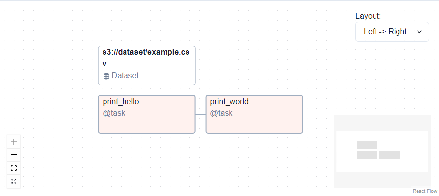

# Airflow Markdown Extension

A custom superfence for pymdown-extensions which render Airflow DAGs.

This is currently a PoC / very experimental project (no tests, no support for task group and dynamic tasks, ...). Not recommended for production use.

## Installation

Install the python library via pip:
```shell
pip install airflow-markdown-extension
```

Load the CSS and Javascript dependencies on your website:
```html
<link rel="stylesheet" href="https://unpkg.com/airflow-markdown-extension/airflow_markdown_extension/js/dist/index.css">
<script src="https://unpkg.com/airflow-markdown-extension/airflow_markdown_extension/js/dist/index.js"></script>
```


## Quick example

When writing Airflow's documentation, you want to show a DAG rendered with the graph view. Use this markdown extension to write a DAG as follow:

~~~markdown
```airflowdag
from airflow import DAG, Dataset
from airflow.decorators import task
from datetime import datetime

with DAG(
    dag_id="hello_world_dag",
    schedule=[Dataset("s3://dataset/example.csv")],
    start_date=datetime(2022, 1, 1),
    catchup=False,
):

    @task
    def print_hello():
        print("Hello")

    @task
    def print_world():
        print("World")

    hello = print_hello()
    world = print_world()

    hello >> world
```
~~~

Which will be rendered in your documentation page like this:




## Configuration

### Mkdocs

To use this superfence with [MkDocs](https://www.mkdocs.org/), add the following to your `mkdocs.yaml`:

```yaml
markdown_extensions:
  - pymdownx.superfences:
      custom_fences:
        - name: "airflowdag"
          class: "airflowdag"
          format: !!python/name:airflow_markdown_extension.fences.fence_airflow_dag_format

extra_css:
  - https://unpkg.com/airflow-markdown-extension/airflow_markdown_extension/js/dist/index.css

extra_javascript:
  - https://unpkg.com/airflow-markdown-extension/airflow_markdown_extension/js/dist/index.js
```

### Standalone

To use this superfence standalone, create a Markdown parser configured like below. You also need to add the **CSS** and **Javascript** in the final HTML document.

```python
import markdown
from airflow_markdown_extension.fences import fence_airflow_dag_format

markdown_source = ...

html = markdown.markdown(
    markdown_source,
    extensions=["pymdownx.superfences"],
    extension_configs={
        "pymdownx.superfences": {
            "custom_fences": [
                {
                    "name": "airflowdag",
                    "class": "airflowdag",
                    "format": fence_airflow_dag_format,
                }
            ]
        }
    },
)

print(html)
```

